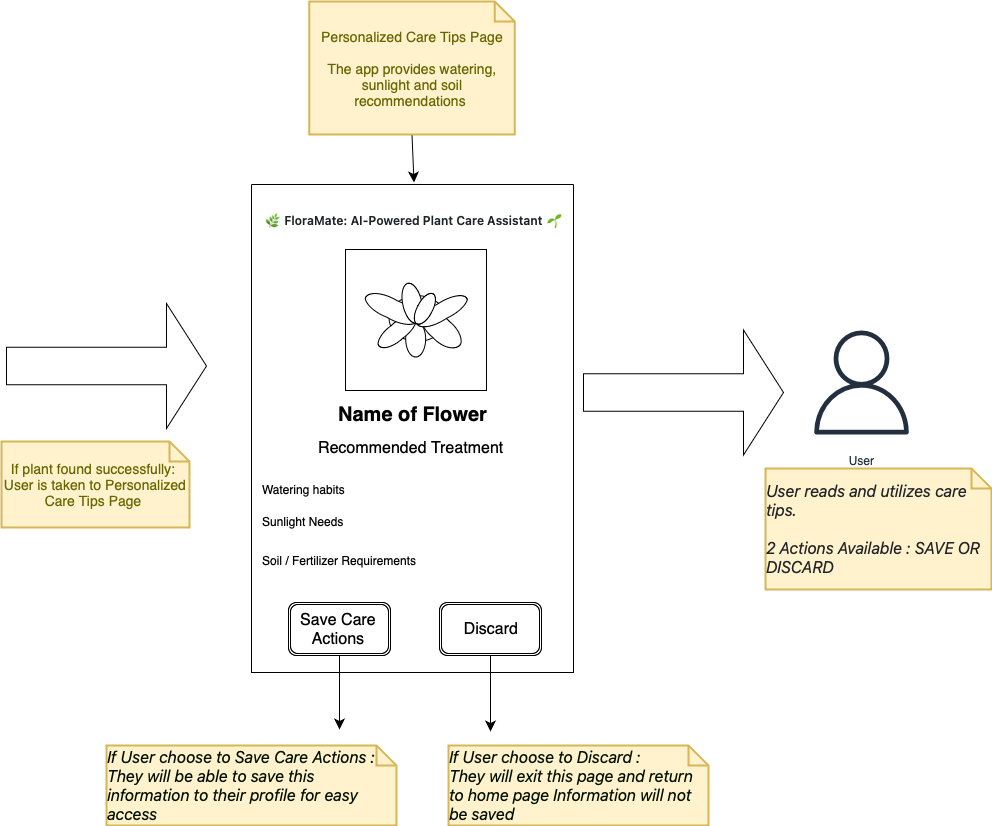

# Storyboard: Plant Care Tips

## User Story
**As a user,**  
I want to receive plant care tips based on my plant type,  
So that I can properly take care of my plants.

## Storyboard Overview
This storyboard outlines how users receive personalized care tips for their plants.

## Screenshots / Storyboard Images
 

Step 1: User uploads a picture of a plant

Step 2: The app provides watering, sunlight, and soil recommendations.

Step 3: User saves or discards the care tip

## Expected Outcome
- Users should get personalized care recommendations.
- Tips should include watering habits, sunlight needs, and fertilizer requirements.
- Users can save care actions or discard.

---

## Velocity Points for User Story

Based on the **complexity**, **effort**, and **dependencies** outlined for the **Plant Care Tips** feature, this user story can be assigned the following **story points**:

| **Story Points** | **Description** |
|------------------|-----------------|
| **13**           | This task is of high complexity due to the integration of personalized plant care tips, which requires significant development and effort. It involves advanced algorithms to web scrape data and comprehensive database design to generate accurate recommendations based on various plant types. |

---

## Criteria for 13 Points:

1. **Complexity**: 
   - The task involves creating a system that generates detailed, personalized care recommendations for different plant types. This requires complex logic for accurately analyzing plant data and offering tailored advice. The integration of AI or database-driven matching would significantly increase complexity.

2. **Effort**: 
   - The effort involved is high, as it includes developing and testing an extensive database or machine learning model to offer personalized care instructions. Additionally, designing the UI to display this information in a clear and accessible way adds to the work required.

3. **Dependencies**: 
   - The system depends on having a rich plant database, accurate identification methods (such as image recognition), and the ability to generate useful and diverse care tips. The integration of these components will require coordination and additional work.

4. **Uncertainty**: 
   - The uncertainty is higher, especially if there is limited data available for some plant types or if the identification process has a degree of error. Furthermore, achieving accurate and useful personalized recommendations requires fine-tuning and testing.

5. **Business Value**: 
   - The business value is very high, as this feature will significantly enhance the user experience by providing customized care tips. It will increase user engagement, promote plant health, and encourage app retention, making it a critical part of the project.

---
