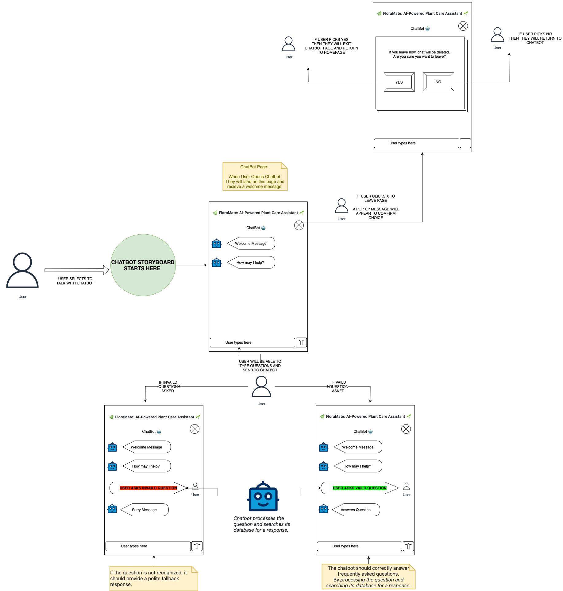

# Storyboard: Chatbot for Basic FAQs

## User Story
**As a user,**  
I want to ask a chatbot about common plant care questions,  
So that I can get quick and reliable answers.

## Storyboard Overview
This storyboard outlines how users interact with the chatbot to ask plant care questions.

## Screenshots / Storyboard Images
Below are the storyboard images for this user story:

Step 1: User asks a question
- *User types a question about plant care into the chatbot.*

Step 2: Chatbot processes query
- *Chatbot processes the question and searches its database for a response.*

Step 3: Chatbot responds
- *Chatbot provides an answer with additional resources if available.*

## Expected Outcome
- The chatbot should correctly answer frequently asked questions.
- If the question is not recognized, it should provide a polite fallback response.

---

## Velocity Points for User Story

Based on the **complexity**, **effort**, and **dependencies** outlined for the **Chatbot for Basic FAQs** feature, this user story can be assigned the following **story points**:

| **Story Points** | **Description** |
|------------------|-----------------|
| **5**            | This task has moderate complexity, as it involves integrating a chatbot with a database of plant care FAQs. The task includes creating a user-friendly interface, ensuring accurate responses, and handling fallback scenarios, which involves several components but is less complex than advanced AI-based features. |

---

## Criteria for 5 Points:

1. **Complexity**: 
   - The feature involves developing a chatbot capable of processing text-based queries and matching them with relevant answers from a database. This is moderately complex as it requires natural language processing (NLP) and database integration, though less advanced than image recognition.

2. **Effort**: 
   - Developing the chatbot functionality, connecting it to a knowledge base, and designing an intuitive UI for asking questions requires significant but not excessive effort.

3. **Dependencies**: 
   - Dependencies include the availability and structure of the plant care FAQ database, as well as the chatbot technology being used.

4. **Uncertainty**: 
   - There is moderate uncertainty regarding the chatbot’s ability to accurately match user questions to the right answers, especially if the database is not comprehensive or if the questions are outside its scope.

5. **Business Value**: 
   - The chatbot offers high business value by providing users with quick, easy access to information about plant care. This improves the user experience, making it more efficient for users to get answers without searching manually.

---
