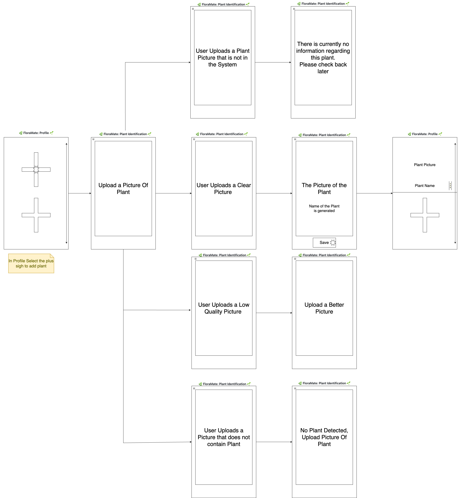

# Storyboard: Plant Identification

## User Story
**As a user,**  
I want to take a picture of a plant and get its name and details,  
So that I can learn more about it.

## Storyboard Overview
This storyboard outlines how users identify plants using image recognition.

## Screenshots / Storyboard Images
  

Step 1: User uploads an image
*User takes or uploads a picture of a plant.*

Step 2: System processes the image
*AI model analyzes the image and matches it to a plant database.*

Step 3: App displays plant details  
*User sees the plant’s name, species, and care instructions.*

## Expected Outcome
- The system should correctly identify common plants.
- Users should get relevant details, including scientific and common names.
- The app may provide similar plant suggestions if confidence is low.

---

## Velocity Points for User Story

Based on the **complexity**, **effort**, and **dependencies** outlined for the **Plant Identification** feature, this user story can be assigned the following **story points**:

| **Story Points** | **Description** |
|------------------|-----------------|
| **8**            | This task involves moderate to high complexity, requiring the integration of an AI-based plant recognition system and a database of plants. It requires not just processing the image but also matching it to the plant data and displaying the relevant results, which increases the task's complexity. |

---

## Criteria for 8 Points:

1. **Complexity**: 
   - The feature requires the integration of AI or machine learning to process images. The system needs to match the image to a plant database, which is a non-trivial task involving complex algorithms and external data sources.
   
2. **Effort**: 
   - This feature demands significant effort, involving both backend (database integration and AI model) and frontend (UI for displaying results). Image recognition, data retrieval, and result presentation all need to work seamlessly.

3. **Dependencies**: 
   - There are significant dependencies on the AI/ML model, the plant database, and image processing infrastructure. Additionally, there may be dependencies on external services or APIs for database matching.

4. **Uncertainty**: 
   - There is moderate uncertainty in how accurately the AI model will process and identify different plants, especially those with less common or similar features. Also, there may be challenges related to the app handling low-confidence matches.

5. **Business Value**: 
   - This feature holds high business value by enabling users to identify plants quickly and accurately. It provides educational content (plant details and care instructions), fostering a positive user experience.

---
